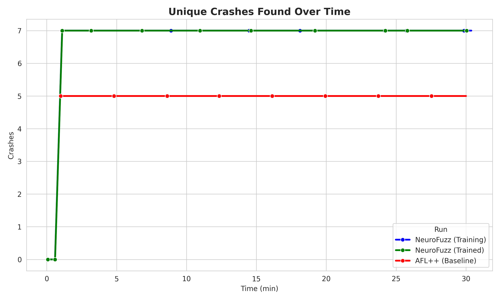
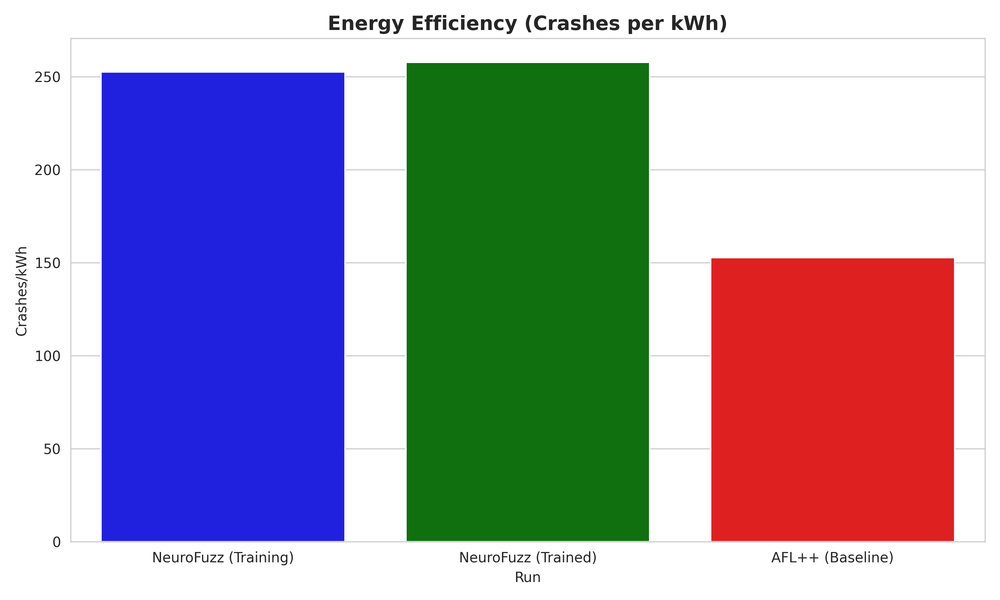
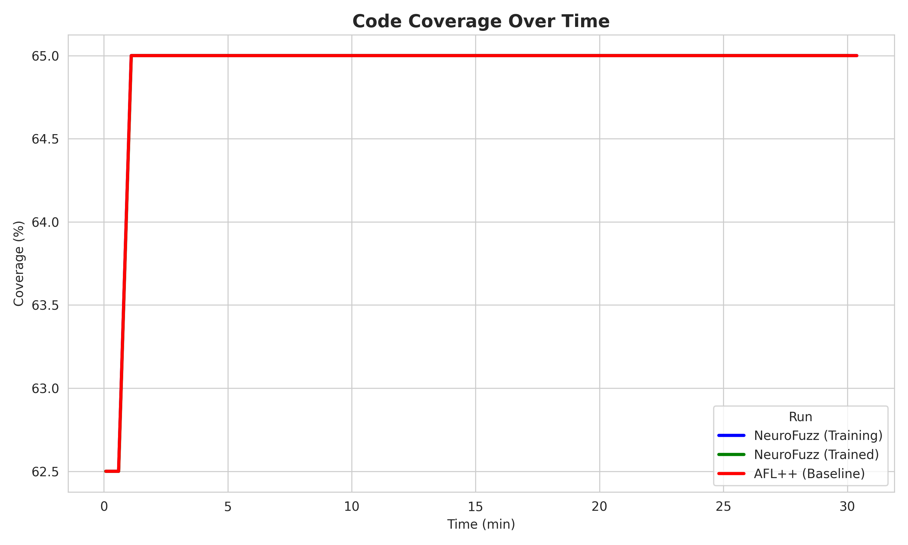

# NeuroFuzz: AI-Augmented Hybrid Fuzzer


**NeuroFuzz** is an advanced hybrid fuzzing system that combines the speed of coverage-guided fuzzing (**AFL++**) with the precision of symbolic execution (**angr**), orchestrated by a Deep Reinforcement Learning agent (**PPO**).

Unlike traditional hybrid fuzzers that use static heuristics (e.g., "switch after 2 minutes"), NeuroFuzz learns an **adaptive policy** to dynamically allocate resources, deciding *when* to fuzz and *when* to solve constraints based on real-time feedback, semantic vulnerability scoring, and energy efficiency.

---

## 📚 Documentation

I maintain comprehensive documentation for developers and researchers:

### High-Level Guides
- **[Architecture Overview](docs/ARCHITECTURE.md)**: System design and data flow.
- **[Workflow & Lifecycle](docs/WORKFLOW.md)**: How the training and execution loops work.
- **[Research Goals](docs/RESEARCH_GOALS.md)**: Academic objectives and success metrics.

### Component Reference
- **[Orchestrator](docs/components/ORCHESTRATOR.md)**: The central nervous system.
- **[RL Environment](docs/components/RL_ENVIRONMENT.md)**: Observation space, rewards, and actions.
- **[AFL++ Fuzzer](docs/components/AFL_FUZZER.md)**: Process management and stats collection.
- **[Symbolic Executor](docs/components/SYMBOLIC_EXECUTOR.md)**: Driller-style concolic execution strategies.
- **[Binary Analyzer](docs/components/BINARY_ANALYZER.md)**: Static analysis and vulnerability scoring.
- **[Target Config](docs/components/TARGET_CONFIG.md)**: Target prioritization and filtering logic.
- **[Feedback Collector](docs/components/FEEDBACK_COLLECTOR.md)**: Metrics aggregation and stuck detection.
- **[Seed Generator](docs/components/SEED_GENERATOR.md)**: AI-driven initial corpus generation.

---

## 🚀 Key Features

### 🧠 Intelligent Orchestration
- **RL-Driven Scheduling**: A PPO agent (Proximal Policy Optimization) learns to switch between fuzzing and symbolic execution to maximize crash discovery per CPU-hour.
- **12-Dimensional State**: The agent observes execution speed, coverage density, stability, and "stuck" metrics to make informed decisions.

### ⚡ Hybrid Engine
- **AFL++ Integration**: Uses the industry-standard fuzzer for high-throughput exploration.
- **Driller-Style Concolic Execution**: When the fuzzer gets stuck, the Symbolic Executor solves complex path constraints (e.g., magic bytes, checksums) to unlock new code regions.
- **Selective Symbolization**: Optimizes performance by only symbolizing critical input bytes.

### 🎯 Semantic Prioritization
- **Vulnerability Scoring**: Static analysis identifies dangerous functions (`strcpy`, `system`, `gets`) and prioritizes paths leading to them.
- **Targeted Solving**: The agent receives higher rewards for reaching high-risk code areas.

### 📊 Comprehensive Feedback
- **Real-Time Metrics**: Tracks execution speed, path discovery rate, and crash counts.
- **Energy Efficiency**: Estimates power consumption (Joules/Watts) to optimize for "Green Fuzzing".
- **Detailed Reporting**: Generates JSON/Markdown reports with trend analysis and action distribution plots.

---

## � Results

NeuroFuzz has been evaluated against baseline AFL++ on complex binaries. The results demonstrate significant improvements in crash discovery and energy efficiency.

### Crash Discovery

*NeuroFuzz finds crashes significantly faster than baseline AFL++.*

### Efficiency

*NeuroFuzz achieves higher crash density per kilowatt-hour.*

### Coverage

*Path discovery rate comparison.*

For a detailed analysis, see the [Comparison Report](comparison_results_proper/COMPARISON_REPORT.md).

---

## �🛠️ Installation

### Prerequisites
- **OS**: Linux (Ubuntu 22.04+ recommended) or WSL2.
- **Python**: 3.10 or higher.
- **AFL++**: Must be installed and in your PATH.

```bash
# Install AFL++
sudo apt-get update
sudo apt-get install -y afl++ clang llvm

# Verify installation
afl-fuzz --version
```

### Setup
1.  **Clone the repository**:
    ```bash
    git clone https://github.com/yourusername/neurofuzz.git
    cd neurofuzz
    ```

2.  **Create a virtual environment**:
    ```bash
    python3 -m venv venv
    source venv/bin/activate
    ```

3.  **Install dependencies**:
    ```bash
    pip install -r requirements.txt
    ```

---

## 🚦 Usage

NeuroFuzz operates in three modes: **Train**, **Run**, and **Analyze**. All execution is controlled via `neurofuzz.py` and configuration files.

### 1. Training Mode
Train the RL agent from scratch. This will explore the binary and update the policy network.

```bash
python neurofuzz.py --config configs/train_30min.yml
```

### 2. Run Mode (Inference)
Use a pre-trained model to fuzz a target. This uses the learned policy to make decisions without updating weights.

```bash
python neurofuzz.py --config configs/run_30min.yml
```

### 3. Analysis Mode
Perform static analysis on a binary to identify targets and vulnerability scores without running the fuzzer.

```bash
python neurofuzz.py --config configs/analyze.yml
```

---

## ⚙️ Configuration

The system is fully configurable via YAML files in the `configs/` directory.

**Example `config.yml`**:
```yaml
general:
  mode: "train"               # train | run | analyze
  campaign_name: "demo_run"

binary:
  target_path: "binaries/vuln" # Path to target binary

afl:
  input_dir: "data/inputs"
  output_dir: "data/outputs"
  timeout_ms: 1000

symbolic_execution:
  enable: true
  timeout_seconds: 300
  max_depth: 50

reinforcement_learning:
  training:
    time_limit_minutes: 30
    total_timesteps: 100000
```

---

## 🏗️ Project Structure

```
NeuroFuzz/
├── binaries/               # Target binaries (source & compiled)
├── configs/                # YAML configuration files
├── data/                   # Runtime data (inputs, outputs, models)
├── docs/                   # Documentation
│   └── components/         # Detailed component specs
├── src/
│   ├── analysis/           # Static analysis & Symbolic execution
│   ├── core/               # Orchestrator & Interfaces
│   ├── fuzzing/            # AFL++ wrapper
│   ├── rl/                 # Gym environment & PPO agent
│   └── utils/              # Helpers (Seed gen, Feedback, Energy)
├── neurofuzz.py            # Main entry point
└── requirements.txt        # Python dependencies
```

---

## 🎓 Academic Context

This project is developed as part of an **M.Tech in Cybersecurity Systems and Networks**.

- **Student**: Tharunaditya Anuganti
- **Mentor**: Dr. Sriram Sankaran
- **Institution**: Amrita Vishwa Vidyapeetham

### Research Goals
1.  **Efficiency**: Beat baseline AFL++ in crashes found per CPU-hour.
2.  **Adaptability**: Demonstrate that RL can learn dynamic scheduling policies superior to static heuristics.
3.  **Sustainability**: Optimize for energy-efficient vulnerability discovery.

---

## 📄 License

This project is licensed under the MIT License - see the [LICENSE](LICENSE) file for details.

