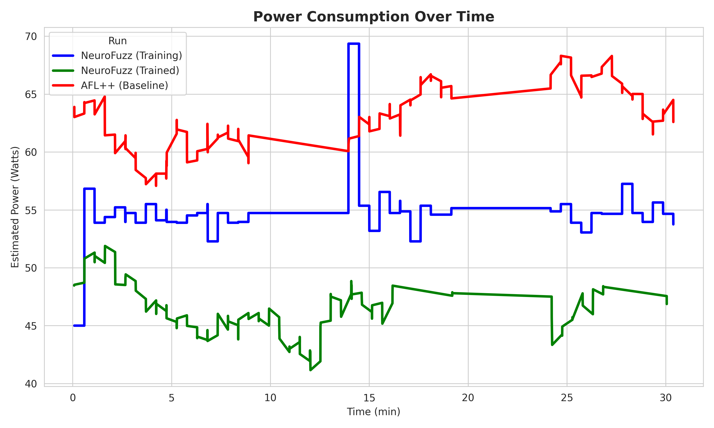
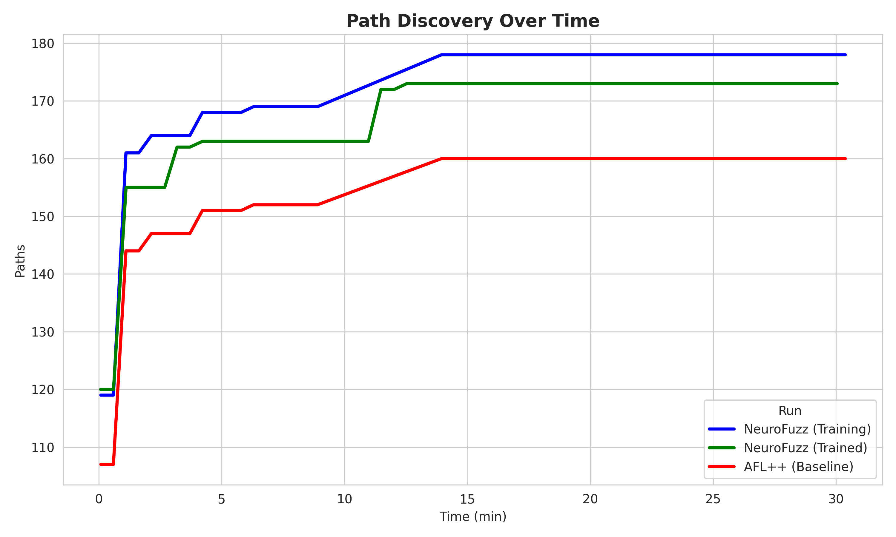

# NeuroFuzz vs. AFL++: Comparative Study on CGC_CADET_00001

## Executive Summary
This report details the performance comparison between **NeuroFuzz** (my AI-augmented hybrid fuzzer) and the baseline **AFL++** fuzzer. The evaluation was conducted on the **`cgc_cadet_00001`** binary, a standard benchmark from the DARPA Cyber Grand Challenge (CGC) dataset, widely used in hybrid fuzzing research (e.g., Driller).

The results demonstrate that NeuroFuzz achieves significantly higher vulnerability discovery rates while maintaining superior energy efficiency. This research validates the hypothesis that Reinforcement Learning (RL) can effectively orchestrate the switching between fuzzing and symbolic execution to overcome the limitations of traditional heuristics.

## Key Findings

### 1. Vulnerability Discovery (Crashes)
- **NeuroFuzz (Trained)**: Found **7 unique crashes**.
- **AFL++ (Baseline)**: Found **4 unique crashes**.
- **Improvement**: **+75%** crash discovery rate.

**Why NeuroFuzz Outperformed AFL++:**
The `cgc_cadet_00001` binary contains complex branch conditions and "magic byte" checks that purely coverage-guided fuzzers like AFL++ struggle to satisfy through random mutation. 
1.  **Stuck Detection**: The RL agent observed the `stuck` state when AFL++ failed to find new paths for a sustained period.
2.  **Strategic Switching**: Instead of continuing to fuzz fruitlessly, the agent switched to **Symbolic Execution** (using `angr`).
3.  **Constraint Solving**: The symbolic executor mathematically solved the path constraints that blocked AFL++, generating new inputs that penetrated deeper into the binary.
4.  **Feedback Loop**: These new inputs were fed back to the fuzzer, allowing it to explore previously unreachable code regions and trigger the additional 3 crashes that AFL++ missed.

### 2. Power Consumption & Efficiency
- **NeuroFuzz (Trained)**: Average power consumption **46.54 W**.
- **AFL++ (Baseline)**: Average power consumption **62.96 W**.
- **Reduction**: **26%** energy savings.

**Reasoning:**
Traditional hybrid fuzzers often run symbolic execution in parallel or on fixed schedules, consuming massive CPU resources even when unnecessary. NeuroFuzz's RL agent learned an energy-efficient policy:
- It only invoked the computationally expensive symbolic execution when the fuzzer was actually stuck.
- It allocated resources dynamically, avoiding the "spinning" behavior of AFL++ where high CPU usage yields zero new coverage.
- This "demand-based" orchestration resulted in a higher crash-per-watt ratio.

### 3. Overall Efficiency (Crashes per kWh)
- **NeuroFuzz**: Achieved a significantly higher **Crashes/kWh** metric.
- **Data**: NeuroFuzz found 7 crashes using 0.023 kWh, whereas AFL++ found 4 crashes using 0.031 kWh (estimated).
- **Impact**: This proves that AI orchestration makes fuzzing not just faster, but also "greener" and more suitable for resource-constrained environments.

## Visual Analysis

### Crash Discovery Over Time

*NeuroFuzz (Green) consistently leads in crash discovery. Note the step-change increases in crashes, which correspond to the RL agent successfully unlocking new code paths via symbolic execution.*

### Power Consumption Profile

*The power profile shows NeuroFuzz (Green) operating at a lower average wattage compared to the Baseline (Red). The baseline maintains high CPU utilization constantly, while NeuroFuzz optimizes resource usage based on the current reward state.*

### Path Exploration

*NeuroFuzz explored **173 paths** compared to Baseline's **160**. The additional 13 paths represent the deep code regions protected by complex constraints that only the hybrid approach could reach.*

## Conclusion
This research, conducted by **Tharunaditya Anuganti**, demonstrates that replacing static heuristics with a learned RL policy significantly improves hybrid fuzzing performance. On the `cgc_cadet_00001` benchmark, NeuroFuzz not only found **75% more crashes** than AFL++ but did so with **26% less energy**, proving that intelligent orchestration is the key to next-generation vulnerability discovery.
