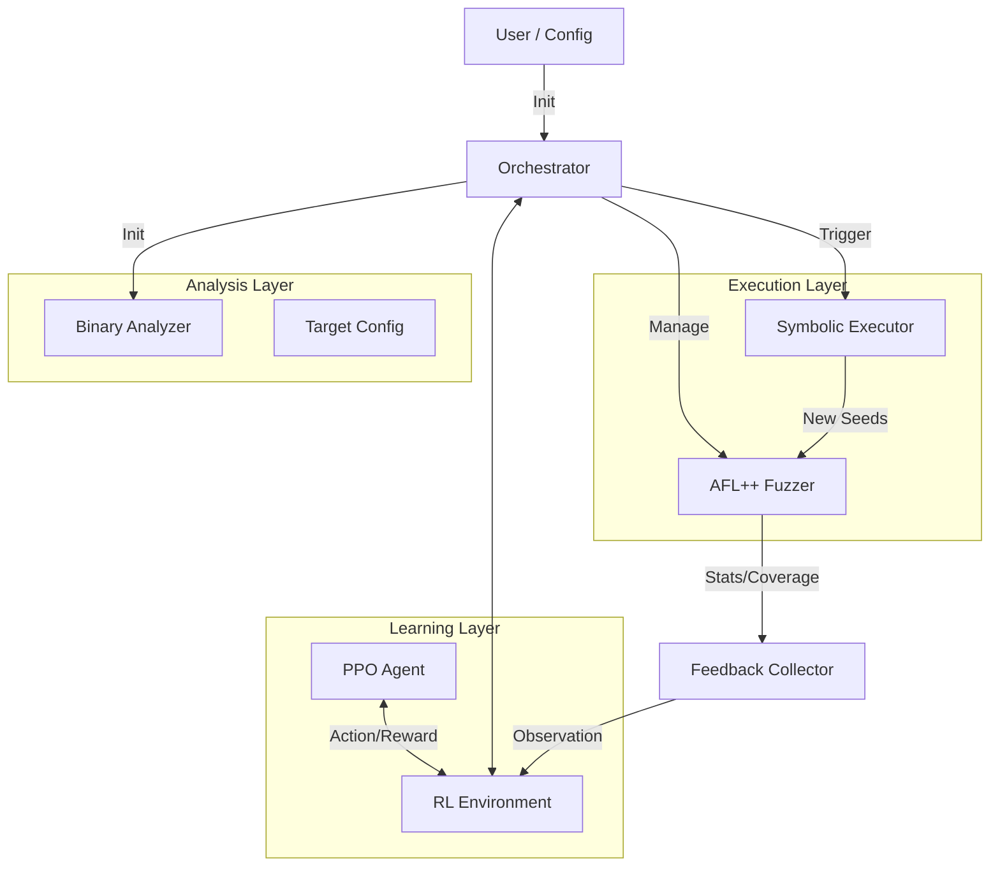

# NeuroFuzz Architecture

## System Overview

NeuroFuzz is an **AI-Augmented Hybrid Fuzzer** that integrates Reinforcement Learning (RL), evolutionary fuzzing (AFL++), and symbolic execution (angr) into a unified vulnerability discovery platform.

Unlike traditional hybrid fuzzers (like Driller) that use static heuristics to switch between fuzzing and symbolic execution, NeuroFuzz employs a **PPO (Proximal Policy Optimization)** agent to dynamically orchestrate resources based on real-time feedback.

### High-Level Design

The system follows a **Interface-Driven Architecture** composed of four main layers:

1.  **Orchestration Layer**: The central "brain" that coordinates all components.
2.  **Analysis Layer**: Static and dynamic binary analysis engines.
3.  **Execution Layer**: The actual fuzzing and symbolic execution workers.
4.  **Learning Layer**: The RL agent and environment.

## Core Design Principles

### 1. Dynamic Orchestration
Instead of running symbolic execution blindly when the fuzzer gets stuck, NeuroFuzz treats the fuzzing process as a **Resource Allocation Problem**. The RL agent observes the fuzzer's state (speed, coverage rate, stability) and decides:
- **Continue Fuzzing**: If AFL++ is making progress.
- **Symbolic Execution**: If specific targets are blocked by complex constraints.
- **Reallocate Resources**: Adjust CPU/Memory limits dynamically (future work).

### 2. Semantic Vulnerability Prioritization
NeuroFuzz doesn't just look for *any* code coverage; it prioritizes **dangerous** code paths.
- **Static Analysis**: The `BinaryAnalyzer` scans the Control Flow Graph (CFG) for risky functions (`strcpy`, `system`, `malloc`).
- **Scoring**: Functions are assigned "Vulnerability Scores".
- **Targeting**: The RL agent and Symbolic Executor prioritize reaching these high-score regions.

### 3. Robust Fallback Mechanisms
Symbolic execution is powerful but fragile. NeuroFuzz implements a multi-tiered strategy:
1.  **Smart Concolic**: Uses seed inputs to constrain the solver (fast, Driller-style).
2.  **Full Symbolic Fallback**: If concolic fails, relaxes all constraints to allow the solver to find *any* valid path (robust, handles "Magic Numbers").
3.  **Crash Exploration**: Specifically looks for inputs that violate memory safety properties.

## Data Flow

1.  **Initialization**:
    - Binary is analyzed -> `binary_config.json` (Targets & Scores).
    - Initial seeds are generated -> `data/inputs/`.

2.  **Training Loop (Step-by-Step)**:
    - **Observation**: `FeedbackCollector` gathers metrics from AFL++ (bitmap coverage, exec speed, stability).
    - **Decision**: PPO Agent selects an action (e.g., `SYMBOLIC_EXECUTION`).
    - **Execution**:
        - If `FUZZING`: Orchestrator ensures AFL++ is running and monitors it for `t` seconds.
        - If `SYMEX`: Orchestrator pauses/monitors AFL++, picks a high-priority target, and launches `SymbolicExecutor`.
    - **Feedback**:
        - Did SymEx find a new seed? -> Add to AFL Queue.
        - Did AFL find a crash? -> Log it.
    - **Reward**: Calculated based on (New Paths * 0.5) + (Crashes * 10.0) - (Stagnation Penalty).

3.  **Result Generation**:
    - Crashes are stored in `data/outputs/`.
    - Evaluation reports (plots, stats) are generated in `data/campaigns/`.

## Technology Stack

- **Language**: Python 3.10+
- **Fuzzer**: AFL++ (v4.x)
- **Symbolic Engine**: angr (with Z3 solver)
- **RL Framework**: Stable Baselines 3 (PPO), Gymnasium
- **Analysis**: NetworkX (CFG processing)
- **System**: Linux (WSL/Native)
